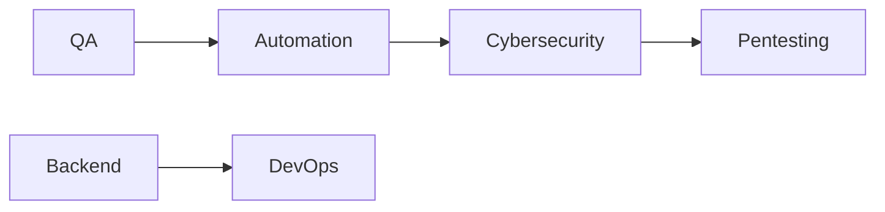

<!-- BANNER -->


<h1 align="center">Hola 👋, Soy Brayan</h1>

<h3 align="center">
💻 Developer | QA Engineer | Cybersecurity Learner
</h3>

<!-- TYPING EFFECT -->
<p align="center">
  
</p>

---

<!-- FOTO -->
<div align="center">


</div>

---

## 🚀 Sobre mí


- 🎓 Ingeniería en Tecnologías de la Información
- 🔍 Enfocado en QA, APIs y Ciberseguridad
- ⚙️ Construyendo proyectos reales con Spring Boot y Python
- 📚 Aprendiendo Pentesting Web y QA Automation
- 🌎 México
- 🚀 Buscando crecer como QA Engineer / Backend Developer

<br><br>

---

## 🛠️ Tecnologías y Herramientas

<div align="center">

### 💻 Backend & Programming


---

### 🗄️ Databases


---

### 📱 Mobile & Tools


---

### 🧪 QA & Cybersecurity


</div>

---

## 📊 GitHub Stats

<div align="center">


</div>

---

## 🔥 Proyectos Destacados

### 🛡️ Cybersecurity Lab
Laboratorio personal para análisis de vulnerabilidades web,
pentesting básico y pruebas de seguridad.

---

### ✅ QA API Testing
Automatización de pruebas para APIs REST usando Postman,
Python y testing manual.

---

### 🛒 WhatsApp Order Bot
Bot automatizado para negocios locales que recibe pedidos
y administra órdenes automáticamente.

---

### 🏨 Hotel Booking System
Sistema de reservaciones para hoteles pequeños con panel administrativo.

---

## 📚 Actualmente aprendiendo

```txt
QA Automation
Pentesting Web
Docker
Linux
OWASP Top 10
APIs REST
CI/CD
````

---

## 🌐 Conecta conmigo

<p align="center">

<a href="LINK-LINKEDIN">

</a>

<a href="LINK-PORTAFOLIO">

</a>

<a href="mailto:TUEMAIL@gmail.com">

</a>

</p>

---

## 🧠 Roadmap Actual



---

<div align="center">

### ⭐ Siempre aprendiendo y construyendo proyectos reales ⭐


</div>
```
